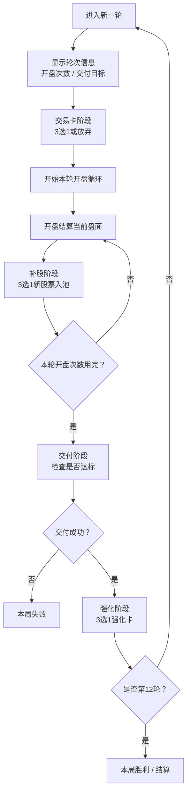

# 4.0 正式策划案

适用项目：`幸运炒股公司`

本文档是 4.0 的统一底稿，先定一套能跑通、能讨论、能继续迭代的方案。

---

## 一、版本目标

### 1. 核心目标

把当前原型收束成一个清晰的轻策略卡牌游戏：

1. 玩家能快速上手。
2. 每轮决策有明确取舍。
3. 股票、资金池、交易卡、强化卡之间有稳定联动。
4. 后续扩展内容时不需要反复推翻底层规则。

### 2. 核心关键词

1. 低认知负荷
2. 股票管理
3. 轻策略
4. 成长爽感
5. 快速迭代

### 3. 当前版本原则

1. 先跑通，再做大。
2. 规则少，但耦合强。
3. 单卡文本尽量短。
4. 复杂度主要来自系统关系，不来自长文案。

---

## 二、核心循环

### 1. 单轮流程

每一轮按下面顺序进行：

1. 显示本轮信息：轮次、开盘次数、交付目标。
2. 进入交易卡阶段：3 选 1，或放弃。
3. 进行若干次开盘。
4. 每次开盘后，从 3 张股票中选 1 张入池。
5. 开盘次数用完后，进行本轮交付。
6. 交付成功，进入强化阶段。
7. 进入下一轮。
8. 交付失败，本局结束。

### 2. 可视化流程图

### 3. 为什么这样设计

这套循环的优点是：

1. 轮开始先做方向选择。
2. 局内主要围绕开盘和补股展开。
3. 每轮结束有明确压力和成长反馈。
4. 每个系统职责很清楚，不容易互相打架。

---

## 三、开局规则

### 1. 初始资金池

开局固定拥有 3 行基础池：

1. 普通池
2. 保险池
3. 红利池

### 2. 初始股票

开局固定发放 3 张 `小型水电站`，并直接落在普通池。

### 3. 这样做的原因

1. 玩家进入游戏就能直接开盘。
2. 不会因为开局随机太差影响体验。
3. 开局体验稳定，方便理解核心循环。

---

## 四、轮次与数值节奏

### 1. 默认轮次曲线

| 轮次 | 开盘次数 | 交付目标 |
| ---- | -------- | -------- |
| 1 | 5 | 25 |
| 2 | 5 | 50 |
| 3 | 6 | 100 |
| 4 | 6 | 150 |
| 5 | 7 | 200 |
| 6 | 7 | 300 |
| 7 | 8 | 400 |
| 8 | 8 | 500 |
| 9 | 9 | 600 |
| 10 | 9 | 700 |
| 11 | 10 | 850 |
| 12 | 10 | 1000 |

### 2. 节奏目标

前期：

1. 学会看盘。
2. 学会补股。
3. 学会区分资金池。

中期：

1. 开始做板块组合。
2. 开始用交易卡改盘面。
3. 强化核心股票。

后期：

1. 形成主 C。
2. 通过高风险池和交易卡转型冲刺。
3. 同时保留保底与套现空间。

---

## 五、资金池系统

### 1. 设计目标

资金池负责定义“环境”。

玩家的核心问题不是只看这张股票强不强，而是：

1. 它应该放在哪一行？
2. 这一行是为了保底，还是为了爆发？

### 2. 资金池总表

| 资金池 | 类型 | 默认获得方式 | 效果 | 默认仓位 | 适合方向 |
| ---- | ---- | ---- | ---- | ---- | ---- |
| 普通池 | 基础池 | 开局固定 | 无额外效果 | 4 | 电力、人才、基础农业 |
| 保险池 | 基础池 | 开局固定 | 本行股票下跌时额外 +1 | 4 | 保险、古董、慢热农业 |
| 红利池 | 基础池 | 开局固定 | 本行股票上涨时额外 +1 | 4 | 科技、古董、爆发股 |
| 助涨池 | 进阶池 | 交易卡新增 | 本行股票上涨概率 +10% | 4 | 科技、电力、辅助启动链 |
| 杠杆池 | 进阶池 | 交易卡新增 | 上涨时额外 +5，下跌时额外 -5 | 4 | 科技、赌爆发古董 |
| 孵化池 | 进阶池 | 交易卡新增 | 本行股票上涨后，永久 +1 上涨值 | 4 | 农业、电力成长流 |
| 保底池 | 进阶池 | 交易卡新增 | 本行股票下跌时，单次最低亏损为 -1 | 4 | 保险、古董、成长保护 |
| 堆积池 | 进阶池 | 交易卡新增 | 无额外效果，但仓位更高 | 6 | 龙头流、同板块堆叠流 |

### 3. 首发默认方案

首发版本先跑这 3 个基础池：

1. 普通池
2. 保险池
3. 红利池

进阶池保留在设计里，但是否首发接入代码，可以放到下一阶段。

---

## 六、交易卡系统

### 1. 设计目标

交易卡负责改盘面。

它不负责替代股票，不负责替代强化，而是负责给玩家“这一轮往哪边走”的方向选择。

### 2. 默认规则

1. 每轮开始时，抽取 3 张交易卡。
2. 玩家 3 选 1，或者放弃。
3. 第 1 轮免费选择 1 张交易卡。
4. 第 2 轮开始按费用结算。

### 3. 交易卡总表

| 交易卡 | 费用 | 效果 | 设计目的 | 默认是否首发 |
| ---- | ---- | ---- | ---- | ---- |
| 加仓位 | 10 | 选择一个资金池，使其仓位 +1 | 缓解爆仓，保护关键股 | 是 |
| 调整 | 10 | 选择 2 张股票，交换位置 | 服务站位、连锁、收尾、主 C 摆位 | 是 |
| 升级池 | 10 | 选择一个资金池，强化该池效果 | 放大既有策略方向 | 是 |
| 套现 | 0 | 立即清仓 1 张股票，并额外获得 +20 | 资金急救，帮助过交付 | 是 |
| 加池子 | 动态 | 新增 1 个进阶资金池 | 战略转型 | 是 |

### 4. 加池子的特殊规则

`加池子` 太强，必须带代价。

默认方案：

| 阶段 | 费用 | 额外代价 |
| ---- | ---- | ---- |
| 第 1-4 轮 | 30 | 新池本轮只能放 1 张股票 |
| 第 5-8 轮 | 50 | 新池本轮只能放 1 张股票 |
| 第 9-12 轮 | 70 | 新池本轮只能放 1 张股票 |

### 5. 交易卡掉落控制

为了保证前期可玩性，默认掉落规则如下：

| 交易卡 | 最早出现轮次 |
| ---- | ---- |
| 加仓位 | 第 1 轮 |
| 调整 | 第 1 轮 |
| 套现 | 第 1 轮 |
| 升级池 | 第 2 轮 |
| 加池子 | 第 2 轮 |

---

## 七、强化卡系统

### 1. 设计目标

强化卡负责改单卡，尤其是：

1. 强化主 C
2. 修补体系短板
3. 让同一局里出现不同终局

### 2. 默认规则

每轮交付成功后：

1. 抽取 3 张强化卡。
2. 玩家选择 1 张。
3. 作用于场上一张股票。

### 3. 强化卡总表

| 强化卡 | 效果 | 类型 | 设计作用 |
| ---- | ---- | ---- | ---- |
| 看涨 | 选择 1 张股票，上涨概率永久 +10% | 概率 | 稳定启动、养主 C |
| 提价 | 选择 1 张股票，永久 +1 上涨值 | 收益 | 最稳定成长 |
| 保险 | 选择 1 张股票，永久 +1 下跌收益 | 防守 | 托底 |
| 红利 | 选择 1 张股票，获得临时 +5 上涨值，持续 1 轮 | 爆发 | 当前轮冲刺 |
| 杠杆 | 选择 1 张股票，上涨值 +5，下跌值 -5 | 风险收益 | 高风险高回报 |
| 妖股 | 选择 1 张股票，+10 上涨值，+50% 上涨概率，下次开盘后自动清仓 | 爆发 | 终极短线冲刺 |
| 本金 | 选择 1 张股票，清仓额外收益 +10 | 兑现 | 适合古董、套现流 |
| 锁仓 | 选择 1 张股票，本轮不能被清仓，且下跌时额外 +1 | 保护 | 保护核心股 |

---

## 八、股票系统总纲

### 1. 首发板块

4.0 首发保留 6 大板块：

1. 电力股
2. 科技股
3. 保险股
4. 农业股
5. 古董股
6. 人才股

暂不首发：

1. 美酒股

原因：

1. 题材有趣，但机制语言暂时不够独立。
2. 当前优先级不如 6 大基础板块。
3. 更适合作为后续扩展包。

### 2. 板块职责总表

| 板块 | 核心语言 | 定位 | 推荐池子 |
| ---- | ---- | ---- | ---- |
| 电力股 | 稳定供能 | 底仓、启动、辅助 | 普通池、助涨池、孵化池 |
| 科技股 | 爆发复制 | 高风险、高上限主 C | 红利池、助涨池、杠杆池 |
| 保险股 | 抗跌保底 | 托底、承接、保命 | 保险池、保底池、普通池 |
| 农业股 | 持续成长 | 慢热、后劲、养成 | 孵化池、保险池、普通池 |
| 古董股 | 买卖兑现 | 清仓、升值、套利 | 红利池、保险池、杠杆池 |
| 人才股 | 组织协同 | 连接、辅助、放大器 | 普通池、助涨池、堆积池 |

### 3. 单卡复杂度规则

| 星级 | 设计要求 |
| ---- | ---- |
| 1 星 | 一句话能读懂，优先做基础功能 |
| 2 星 | 开始承担板块流派骨架 |
| 3 星 | 定义板块上限，成为板块宣言卡 |

---

## 九、首发完整股票卡池

默认采用：

1. 每板块 6 张
2. 共 36 张
3. 2 张 1 星
4. 2 张 2 星
5. 2 张 3 星

### 1. 股票总表

| 板块 | 股票名 | 星级 | 上涨 | 下跌 | 效果 | 定位 |
| ---- | ---- | ---- | ---- | ---- | ---- | ---- |
| 电力股 | 小型水电站 | 1 | +2 | 0 | 看涨1 | 开局启动股 |
| 电力股 | 储能设施 | 1 | +2 | 0 | 上涨后，右侧股票临时获得弹性1 | 基础辅助 |
| 电力股 | 区域电网 | 2 | +3 | 0 | 本行每有 1 张电力股，本股上涨时额外 +1 | 数量核心 |
| 电力股 | 输电枢纽 | 2 | +3 | -1 | 上涨后，后续 1 张股票获得看涨1 | 启动链条 |
| 电力股 | 国家电网集团 | 3 | +4 | 0 | 持有时，本行电力股上涨概率 +10% | 电力宣言卡 |
| 电力股 | 算力供电中心 | 3 | +4 | 0 | 上涨后，后续所有科技股临时获得弹性1 | 跨板块发动机 |
| 科技股 | 云计算概念 | 1 | +4 | -3 | 看涨1 | 基础爆发股 |
| 科技股 | AI应用厂商 | 1 | +5 | -3 | 弹性1 | 直给收益股 |
| 科技股 | 算力租赁平台 | 2 | +5 | -4 | 前一位上涨时，本股临时获得看涨2 | 跟风爆发 |
| 科技股 | 机器人产业链 | 2 | +5 | -4 | 上涨后，复制右侧股票的基础上涨值，持续到本轮结束 | 局内复制件 |
| 科技股 | 妖股孵化器 | 3 | +6 | -5 | 上涨后，本股永久 +1 上涨值；位于杠杆池时额外 +1 | 成长型主 C |
| 科技股 | 量子科技龙头 | 3 | +8 | -7 | 上涨后，复制自身到本池末尾，每轮最多触发 1 次 | 科技终局卡 |
| 保险股 | 意外险 | 1 | +1 | 0 | 防守2 | 最简单托底股 |
| 保险股 | 医疗险 | 1 | +2 | 0 | 下跌后，右侧股票临时获得防守1 | 基础承接股 |
| 保险股 | 联保平台 | 2 | +2 | 0 | 本行每有 1 张保险股，本股下跌时额外 +1 | 数量核心 |
| 保险股 | 风险对冲盘 | 2 | +3 | 0 | 前一位下跌时，本股本次开盘额外 +2 | 逆势承接器 |
| 保险股 | 赔付结算中心 | 3 | +3 | 0 | 清仓时额外 +4；若本轮曾下跌，再额外 +2 | 保险兑现卡 |
| 保险股 | 超级保障集团 | 3 | +4 | +1 | 持有时，本行股票下跌时额外再 +1 | 保险宣言卡 |
| 农业股 | 向日葵 | 1 | +1 | -2 | 每次上涨后，永久 +1 上涨值 | 基础成长股 |
| 农业股 | 农家乐 | 1 | +2 | -1 | 分红1 | 温和成长股 |
| 农业股 | 竹林 | 2 | +3 | -1 | 本行每有 1 张农业股，本股上涨时额外 +1 | 数量核心 |
| 农业股 | 堆肥场 | 2 | +2 | 0 | 本股上涨后，右侧农业股永久 +1 上涨值 | 成长辅助 |
| 农业股 | 机械农场 | 3 | +4 | -2 | 本轮每经历 1 次开盘，本股永久 +1 上涨值 | 终局成长核 |
| 农业股 | 丰收结算季 | 3 | +4 | 0 | 清仓时获得本股本局累计上涨次数 x 2 的金币 | 农业兑现核 |
| 古董股 | 铜币收藏 | 1 | +2 | 0 | 清仓价值1 | 基础兑现股 |
| 古董股 | 旧瓷器 | 1 | +3 | -1 | 上涨后，本股清仓价值 +1 | 升值股 |
| 古董股 | 邮票册 | 2 | +3 | 0 | 每次上涨后，永久 +1 清仓价值 | 成长兑现股 |
| 古董股 | 拍卖行 | 2 | +4 | -1 | 清仓时，左侧股票也获得 +2 金币 | 带动兑现股 |
| 古董股 | 国宝拍卖会 | 3 | +4 | 0 | 本股清仓时，获得本池古董股数量 x 3 的额外金币 | 数量结算核 |
| 古董股 | 黄金藏馆 | 3 | +5 | 0 | 持有时，本行所有古董股清仓价值 +1 | 古董宣言卡 |
| 人才股 | 实习交易员 | 1 | +1 | -1 | 入池时获得 +2 金币 | 前期资金辅助 |
| 人才股 | 复盘分析师 | 1 | +2 | 0 | 右侧股票获得看涨1 | 基础连接件 |
| 人才股 | 板块研究员 | 2 | +3 | 0 | 右侧与自己同板块的股票上涨时额外 +2 | 板块拼装件 |
| 人才股 | 机构操盘手 | 2 | +3 | 0 | 上涨后，后续股票临时获得看涨1 | 链式启动件 |
| 人才股 | 首席策略官 | 3 | +4 | 0 | 持有时，本行同板块股票上涨概率 +10% | 协同核心 |
| 人才股 | 资本操盘总监 | 3 | +4 | 0 | 每轮第一次上涨后，选择本行 1 张股票获得弹性2 | 人才宣言卡 |

### 2. 开局股单独说明

| 股票名 | 板块 | 星级 | 上涨 | 下跌 | 效果 | 备注 |
| ---- | ---- | ---- | ---- | ---- | ---- | ---- |
| 小型水电站 | 电力股 | 1 | +2 | 0 | 看涨1 | 固定开局 3 张 |

---

## 十、默认可跑通方案

为了先落出一个稳定原型，默认采用以下组合：

### 1. 首发必做内容

| 模块 | 默认方案 |
| ---- | ---- |
| 核心循环 | 轮开始 -> 交易卡 -> 开盘/补股 -> 交付 -> 强化 |
| 基础池 | 普通池、保险池、红利池 |
| 初始股票 | 3 张小型水电站，直接落在普通池 |
| 交易卡 | 5 张：加仓位、调整、升级池、套现、加池子 |
| 强化卡 | 8 张 |
| 股票池 | 36 张，6 大板块 |
| 第 1 轮特殊规则 | 免费选择 1 张交易卡 |

### 2. 可以后补的内容

| 模块 | 后续补充方向 |
| ---- | ---- |
| 进阶池 | 助涨池、杠杆池、孵化池、保底池、堆积池 |
| 新板块 | 美酒股 |
| 更复杂机制 | 更多复制、跨板块联动、特殊事件 |
| 表现层 | 更多剧情和演出 |

### 3. 实现优先级建议

| 顺序 | 模块 |
| ---- | ---- |
| 1 | 替换首发股票卡池 |
| 2 | 接入交易卡系统 |
| 3 | 接入进阶池 |
| 4 | 继续扩展板块与特殊机制 |

---

## 十一、结论

4.0 的重点不是“内容更多”，而是“结构更清楚”。

最终边界如下：

1. 股票负责组合。
2. 资金池负责环境。
3. 交易卡负责改盘面。
4. 强化卡负责养主 C。
5. 交付负责逼玩家做取舍。

只要这 5 层边界守住，后面继续加内容就不会乱。
