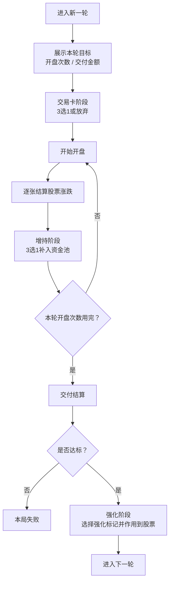

# 《幸运炒股公司》简历版设计说明

## 1. 项目定位

一个轻策略、强反馈的网页卡牌游戏原型。  
玩家围绕“开盘 -> 补股 -> 交付 -> 强化”的循环经营股票池，在有限轮次内完成资金目标。

适合在简历中描述为：

- 独立完成轻策略卡牌游戏原型设计与前端实现
- 将股票涨跌、卡牌构筑、资源池管理整合为单局循环
- 负责规则设计、数值框架、交互流程与界面迭代

---

## 2. 核心玩法

每轮的核心决策只有三类：

1. 开局是否选择交易卡，决定本轮运营方向
2. 每次开盘后补入哪张股票，决定盘面结构
3. 交付成功后强化哪张核心股票，决定长期成长路线

设计目标：

- 上手简单：第一轮直接给出 3 张新手股，避免复杂教学
- 决策清晰：交易卡管“改盘面”，强化卡管“改单卡”
- 反馈直接：上涨红、下跌绿，卡面与动画即时表现结果

---

## 3. 单轮流程图

---

## 4. 系统拆分

### 4.1 股票系统

股票是主要收益来源，每张股票包含：

- 上涨收益
- 下跌收益
- 稀有度
- 卡牌效果
- 可叠加的强化标记

股票不只看单卡强度，还要看“放在哪个池子里”。

### 4.2 资金池系统

资金池定义的是环境，而不是额外角色技能。

首轮默认池子：

- 普通池：无额外效果
- 助涨池：本行股票上涨概率 +10%
- 保险池：本行股票下跌时额外 +1

设计意义：

- 普通池负责承接基础股票
- 助涨池负责放高爆发股票
- 保险池负责放兜底股票

### 4.3 交易卡系统

交易卡负责改盘面，不直接替代股票或强化。

首发核心交易卡：

- 调整：交换两张股票位置
- 升级池：强化已有资金池效果
- 套现：立即移除一张股票并获得金币
- 加池子：新增一个进阶资金池

### 4.4 强化系统

强化卡负责改单卡，形成养成感。

典型强化方向：

- 看涨：永久提高上涨概率
- 高弹性：上涨时额外赚钱
- 防守：下跌时减少损失
- 连板预期：下一次开盘必涨

---

## 5. 新手股票设计示例

| 卡名 | 所在池 | 上涨 | 下跌 | 作用 |
| ---- | ---- | ---- | ---- | ---- |
| 新手礼盒 | 普通池 | +10 | 0 | 帮玩家直观看懂“上涨高收益” |
| 新手赠股 | 助涨池 | +3 | -1 | 帮玩家理解“高收益伴随风险” |
| 新手保险 | 保险池 | +1 | +2 | 帮玩家理解“下跌也能有保护收益” |

这一组新手卡的设计思路是：

- 三张卡分别对应三种基础体验
- 第一轮不需要读太多文字，也能理解系统差异
- 用固定起手替代随机发牌，降低首局失败感

---

## 6. 关键设计亮点

- 把传统“股票涨跌”抽象成可管理、可构筑、可成长的卡牌系统
- 用“资金池”承担站位与环境效果，让策略不只发生在单卡数值上
- 用“交易卡 / 强化卡 / 股票卡”三套职责分离的牌组降低理解负担
- 强反馈视觉设计让涨跌结果、风险感和成长感都能被即时看见

---

## 7. 简历可直接使用的项目描述

### 版本 A：偏策划

设计并迭代一款股票题材轻策略卡牌游戏原型，搭建“交易卡改盘面、股票卡产出收益、强化卡养核心单卡”的三层规则结构；完成首轮新手体验、资金池机制、单局循环与数值框架设计，并通过流程压缩与强反馈视觉提升可读性和上手效率。

### 版本 B：偏产品/前端

独立完成网页卡牌游戏原型的规则设计与前端落地，围绕“开盘、增持、交付、强化”搭建单局循环，设计普通池/助涨池/保险池等差异化资源池，并持续优化首轮引导、卡面反馈、弹窗流程和关键交互体验。
